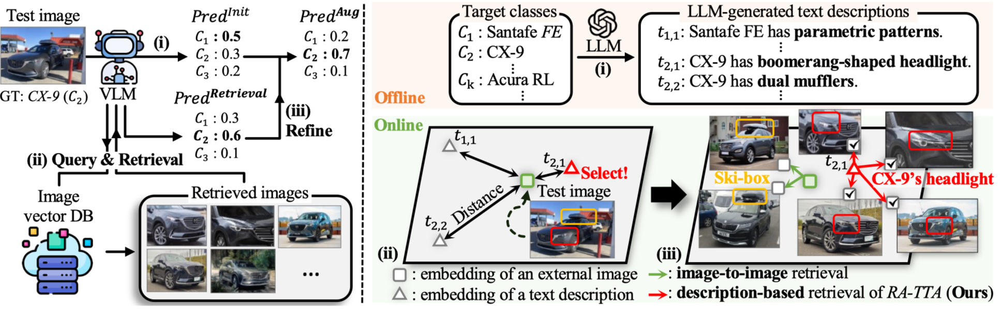

[](https://pytorch.org/)
[](https://iclr.cc)
[](https://opensource.org/licenses/MIT)

# RA-TTA
Retrieval-Augmented Test-Time Adaptation for Vision-Language Models

## About
The official source code for [**RA-TTA: Retrieval-Augmented Test-Time Adaptation for Vision-Language Models**](https://openreview.net/pdf/86d3293ab2d788dc7a7a4cd22a101eba7e501237.pdf), accepted at ICLR 2025.

## Overview
Vision-language models (VLMs) are known to be susceptible to distribution shifts between pre-training data and test data, and test-time adaptation (TTA) methods for VLMs have been proposed to mitigate the detrimental impact of the distribution shifts. However, the existing methods solely rely on the internal knowledge encoded within the model parameters, which are constrained to pre-training data. To complement the limitation of the internal knowledge, we propose Retrieval-Augmented-TTA (RA-TTA) for adapting VLMs to test distribution using external knowledge obtained from a web-scale image database. By fully exploiting the bi-modality of VLMs, RA-TTA adaptively retrieves proper external images for each test image to refine VLMs’ predictions using the retrieved external images, where fine-grained text descriptions are leveraged to extend the granularity of external knowledge. Extensive experiments on 17 datasets demonstrate that the proposed RA-TTA outperforms the state-of-the-art methods by 3.01–9.63% on average.



  
## Environments
The system RA-TTA used and tested in
- Python 3.11.7
- Ubuntu 20.04.4 LTS
- pytorch==2.3.0
- torchvision==0.18.0
- An NVIDIA GeForce RTX 4090

## Installation
- conda create -n RATTA python==3.11.7
- conda install pytorch==2.3.0 torchvision==0.18.0 torchaudio==2.3.0 pytorch-cuda=12.1 -c pytorch -c nvidia
- conda install faiss-gpu==1.8.0
- pip install tqdm==4.65.0
- pip install git+https://github.com/openai/CLIP.git
- pip install scipy==1.11.4
- pip install pandas==2.2.1
- pip install pot==0.9.4

#### Directory structure
```
RA-TTA/
|–– data
|–––– fgvc_aircraft
|–––– ... 
|–– db_embedding
|–––– LAION2B_fgvc_aircraft_aux_ViT-B_16
|–––– ... 
|–– test_embedding
|–––– ViT-B_16
|–––––––– 0
|–––––––––––– fgvc_aircraft.pth
|–––––––––––– ... 
|–– descriptions
|–––– CuPL_prompts_fgvc_aircraft.json
|–––– ... 
|–– src
|–––– datalaoder
|–––– utils
|–– imgs
|–– logs
|–– ratta_after_extract_imagenet.py
|–– ratta_after_extract.py
|–– ratta_pre_extract_imagenet.py
|–– ratta_pre_extract.py
|–– README.md
```

## Datasets
For the test datasets except Caltech256 and RESISC45, please refer to this [[page](https://github.com/KaiyangZhou/CoOp/blob/main/DATASETS.md)]. </br>
For the test split of RESISC45 and caltech256, please refer to this [[page](https://www.kaggle.com/datasets/aqibrehmanpirzada/nwpuresisc45)] and [[page](https://github.com/vishaal27/SuS-X/blob/main/data/DATA.md)], respectively. 

## Download image vector database
We provide the precomputed image embeddings as vector databases, which can be used to reproduce main results. </br>
You can download the embeddings from this [[link](https://drive.google.com/drive/folders/1EF8VgitV8xFatQAxNwpf1RTb2PhPQMah?usp=sharing)] and put them under the './db_embedding' directory.

## Implementation
For efficient experimentation, first extract **test** embeddings and then run RA-TTA using these embeddings.
- Extract test embeddings: 
```
python ratta_pre_extract.py --root [DATA_ROOT] --dataset [DATASET] --seed [SEED] --gpu [GPU_ID]
```
- Run RA-TTA: 
```
python ratta_after_extract.py --db_root [DB_ROOT] --tst_embedding_root [TEST_EMBEDDING_ROOT] --dataset [DATASET] --seed [SEED] --gpu [GPU_ID]
```

## Citation
If you found this work useful, please consider citing it as:
```
@inproceedings{lee2025ratta,
  title={RA-TTA: Retrieval-Augmented Test-Time Adaptation for Vision-Language Models},
  author={Lee, Youngjun and Kim, Doyoung and Kang, Junhyeok and Bang, Jihwan and Song, Hwanjun and Lee, Jae-Gil},
  booktitle={ICLR},
  year={2025}
}
```

## Acknowledgements
We build on several great repositories including [CLIP](https://github.com/openai/CLIP/tree/main/clip), [CoOp](https://github.com/KaiyangZhou/CoOp/), [CuPL](https://github.com/sarahpratt/CuPL), and [SUS-X](https://github.com/vishaal27/SuS-X). We thank the authors for providing such amazing codebase and enabling research towards better vision-language model adaptation. We also thank the authors of the [LAION-5B](https://laion.ai/blog/laion-5b/) projects.
